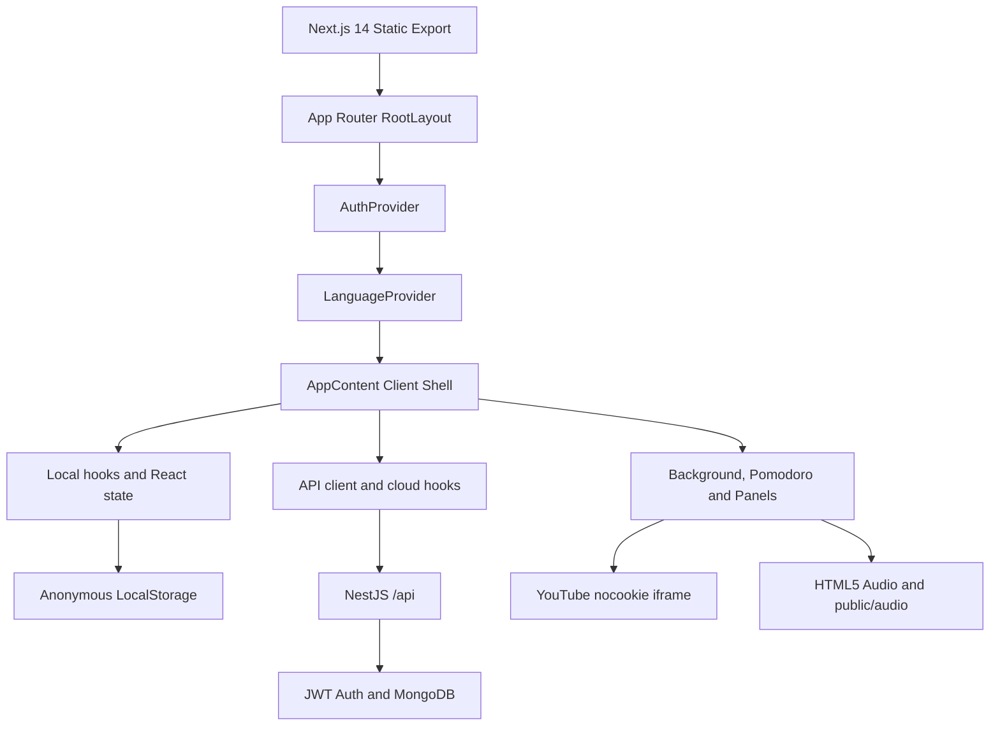

# Pomodoro Frontend Technical Architecture

## 1. Architecture overview

Pomodoro frontend là một static client hybrid: anonymous mode chạy độc lập với backend, còn authenticated mode gọi Pomodoro Backend để đồng bộ các resource được hỗ trợ.



Frontend không kết nối trực tiếp tới MongoDB. Backend là optional đối với anonymous mode và là dependency của cloud sync khi người dùng authenticated.

## 2. Runtime và tech stack

| Thành phần | Công nghệ / triển khai |
|---|---|
| Framework | Next.js 14 App Router |
| Language | TypeScript strict |
| Rendering/deployment | Client components, `output: 'export'`, static output |
| UI/styling | React 18, Tailwind CSS, CSS Glassmorphism |
| Icons | Lucide React |
| State | React state, `LanguageContext`, `AuthContext` |
| Local audio | HTML5 Audio với MP3 trong `public/audio` |
| YouTube | `youtube-nocookie.com` iframe embed |
| Browser persistence | LocalStorage cho anonymous data và language |
| API transport | Browser `fetch`, Bearer access token, credentials |

`framer-motion` và `canvas-confetti` vẫn nằm trong dependencies của frontend, nhưng UI hiện tại chủ yếu dùng React và Tailwind classes; chúng không phải dependency bắt buộc của data flow cloud.

## 3. Component và data flow

- `src/app/layout.tsx` tạo RootLayout, metadata và bọc children bằng `AuthProvider` rồi `LanguageProvider`.
- `src/App.tsx` chứa `AppContent`, phối hợp background, Pomodoro, dock, panels, auth button và cloud hooks.
- `AuthProvider` quản lý `loading`, `anonymous`, `authenticated`, user profile và auth errors.
- `apiClient.ts` chuẩn hóa API base URL, headers, credentials, access token memory, refresh single-flight và một lần retry sau 401.
- `storage.ts` đọc/ghi anonymous todos, wallpapers và stations một cách SSR-safe.
- `adapters.ts` map model backend sang `TodoItem`, `Wallpaper` và `LofiStation` của frontend.
- `useCloudTodos` chọn LocalStorage hoặc API persistence theo auth status, đồng bộ local-only todos và xử lý UTC daily reset.
- `useCloudWallpapers` tải/sync custom wallpapers.
- `useCloudStations` tải/sync saved YouTube tracks.
- `usePomodoro` và `useAudioMixer` quản lý runtime state local, không phụ thuộc backend.

## 4. Project structure

```text
PomodoroFE/
├── docs/
│   ├── PRD.md
│   └── TECH_ARCHITECTURE.md
├── public/audio/                 # Local ambient MP3 assets
├── src/
│   ├── app/                      # Root layout, page and global CSS
│   ├── components/
│   │   ├── auth/                 # AuthPanel
│   │   ├── background/
│   │   ├── dock/
│   │   ├── mixer/
│   │   ├── music/
│   │   ├── pomodoro/
│   │   ├── todo/
│   │   └── wallpaper/
│   ├── context/                  # AuthContext and LanguageContext
│   ├── data/                     # Curated presets
│   ├── hooks/                    # Local and cloud hooks
│   ├── i18n/                     # VI/EN translations
│   ├── services/                 # apiClient, adapters and storage
│   └── types/                    # Frontend domain types
├── next.config.mjs               # output: 'export'
├── package.json
└── tsconfig.json
```

## 5. Persistence và authentication transport

### 5.1. Anonymous persistence

Anonymous todos, custom wallpapers, saved stations và language choice được lưu trong browser LocalStorage. Các helper trong `services/storage.ts` chịu trách nhiệm SSR-safe access và tolerate LocalStorage failures.

### 5.2. Authenticated session

- `apiClient.ts` giữ access token trong module memory; token mất khi reload.
- Refresh token không được đọc bởi JavaScript; browser gửi cookie HttpOnly qua `credentials: 'include'`.
- Khi mount, `AuthProvider` gọi `POST /api/auth/refresh`, sau đó gọi `GET /api/users/me`.
- Khi protected request trả 401, API client dùng một shared refresh promise để tránh refresh đồng thời, retry request đúng một lần và không retry endpoint refresh.
- Refresh failure xóa access token và đưa AuthProvider về anonymous mode.
- Auth response có dạng `{ accessToken, user }`; refresh token không nằm trong JSON response.

### 5.3. Cloud sync

Khi authenticated, cloud hooks tải resource của user từ backend và có thể upload các record local-only. Todos, wallpapers và stations được map qua adapters. Backend là nơi xác định owner; frontend không gửi `userId`.

Backend wallpaper hỗ trợ `image | video | custom`, trong khi frontend domain hiện biểu diễn `image | video`; adapter hiện map giá trị `custom` sang kiểu hiển thị image. Đây là giới hạn mapping hiện tại.

## 6. Frontend–backend contract

API base lấy từ `NEXT_PUBLIC_API_URL`, mặc định là `http://localhost:3001/api`. Client chuẩn hóa trường hợp biến môi trường đã hoặc chưa có hậu tố `/api`.

| Chức năng | Endpoint |
|---|---|
| Register | `POST /api/auth/register` |
| Login | `POST /api/auth/login` |
| Refresh | `POST /api/auth/refresh` |
| Logout | `POST /api/auth/logout` |
| Current user | `GET /api/users/me` |
| Todos | `GET/POST/PATCH/DELETE /api/todos` |
| Wallpapers | `GET/POST/DELETE /api/wallpapers` |
| YouTube tracks | `GET/POST/DELETE /api/youtube-tracks` |

Request rules:

- Protected requests gửi `Authorization: Bearer <accessToken>`.
- Mọi request dùng `credentials: 'include'` để hỗ trợ refresh cookie.
- Resource DTO không chứa `userId`.
- API errors được chuyển thành `ApiError` với status và error body.

## 7. Security và browser boundary

- Không lưu access token hoặc refresh token vào LocalStorage.
- `NEXT_PUBLIC_API_URL` chỉ là public endpoint configuration, không chứa secrets.
- Production phải dùng HTTPS để secure cookie hoạt động đúng.
- `CORS_ORIGIN` của backend phải cho phép origin frontend; credentials phải được bật ở cả hai phía.
- API failure của cloud hooks không được làm hỏng các tính năng local/static.
- YouTube được nhúng qua `youtube-nocookie.com`; frontend không xử lý credential YouTube.

## 8. Date semantics

`useCloudTodos` tạo date key bằng `new Date().toISOString().split('T')[0]`, tức UTC `YYYY-MM-DD`. Hook kiểm tra ngày khi mount và theo interval khoảng 60 giây. Khi UTC date đổi, completed tasks bị loại bỏ và incomplete tasks được giữ lại. Đây không phải local-midnight behavior.

## 9. Deployment

- Chạy `npm run build` để tạo static output trong `out/`.
- Deploy frontend lên static host/CDN; không dùng frontend để truy cập MongoDB.
- Cung cấp `NEXT_PUBLIC_API_URL` tại thời điểm build.
- Backend phải cho phép frontend origin qua CORS và hỗ trợ credentials.
- Trong production, static frontend và NestJS backend nên được phục vụ qua HTTPS.
